# System-Spezifikation NaviApp

## 1. Ausgangslage und Zielsetzung
### 1.1 Ist-Situation
Die Grundidee ist eine Navi-App zu entwickeln, wobei der Hauptfokus auf Routenplanung und Erlernung der technischen Hintergründe liegt.

Derzeit befinden sich diverse ausgereifte Navis auf dem Markt, jedoch kann man hierbei die Technologie hinter der Navigation und Routenplanung nicht erkennen.
Aus diesem Grund möchten wir auf einer interaktiven Karte unsere eigene Navigation programmieren.

### 1.2 Zielsetzung
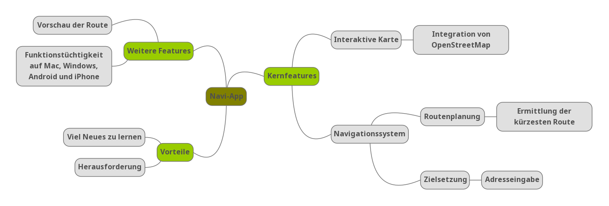

## 2. Funktionale Anforderung

### 2.1 Use Case Überblick 
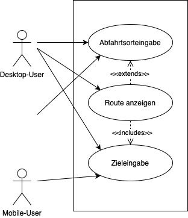

Dem End-User kann seinen beliebigen Start- und Endpunkt eingeben, aus welchen eine Route
berechnet wird.
Weiters kann der User diese betrachten und die aktive Navigation mithilfe eines Buttons
starten.

### Interaktives GUI-Mockup
#### Desktop-Version
https://www.figma.com/proto/Ah6Tco7vuK3Hox6kyLX9Er/Untitled?node-id=1%3A3&starting-point-node-id=9%3A32&scaling=scale-down

#### Mobile-Version
https://www.figma.com/proto/Ah6Tco7vuK3Hox6kyLX9Er/Untitled?node-id=15%3A79&scaling=scale-down&page-id=15%3A58&starting-point-node-id=15%3A59

### 2.2 Abfahrtsortsangabe
#### 2.2.1 GUI-Design
Für den Abfahrtsort wird entweder der Standort des Useres oder die selbstständige Eingabe verwendet.

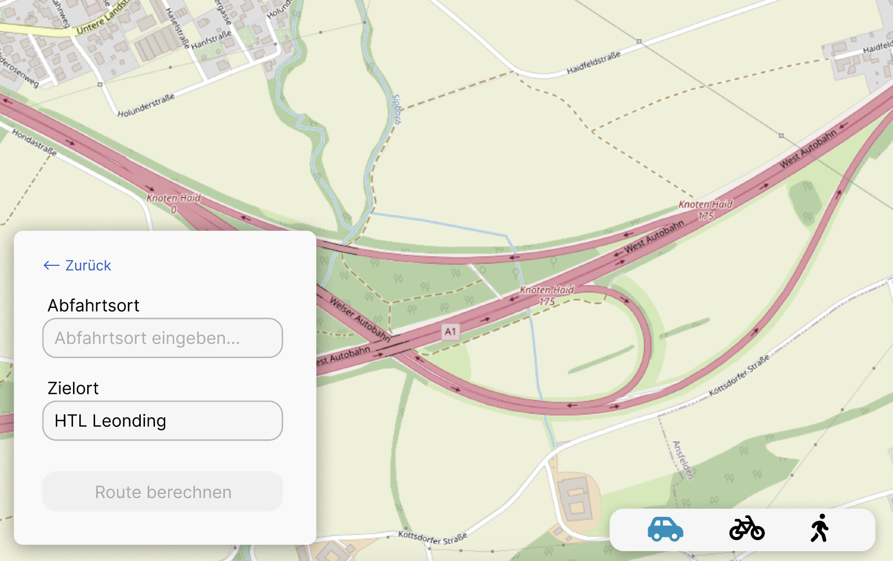

Das obige Bild zeigt die Desktop-Version.

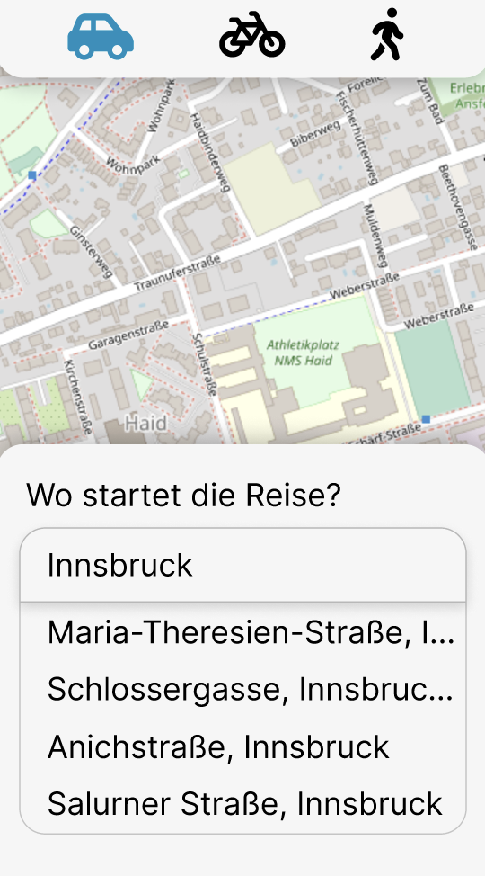

Das obige Bild zeigt die Mobile-Version.

### 2.3 Zieleingabe
Die Zieleingabe muss manuell erfolgen. Bei der Eingabe werden ähnliche Vorschläge angezeigt.

#### 2.3.1 GUI-Design
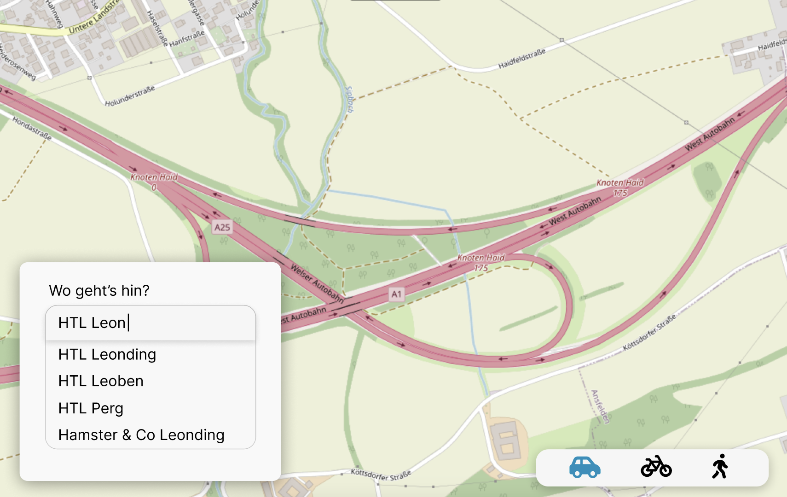

Das obige Bild zeigt die Desktop-Version.

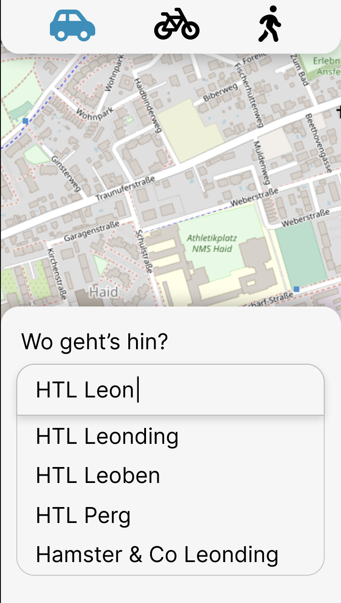

Das obige Bild zeigt die Mobile-Version.

### 2.4 Route anzeigen
#### 2.4.1 GUI-Design
Wenn Abfahrt- und Zielort valide eingegeben wurden, kann die Route berechnet werden.
Eine aktive Navigation ist jeodch nur auf Mobilgeräten vorhanden. Auf Desktop-Geräten kann die Route jediglich betrachtet werden. 

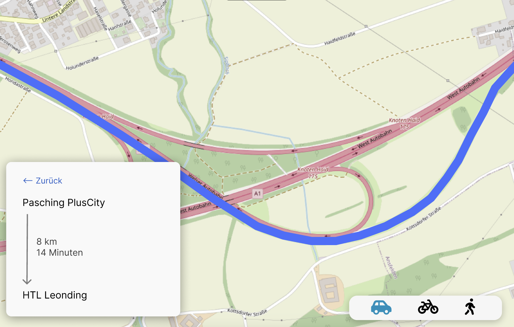

Das obige Bild zeigt die Desktop-Version.

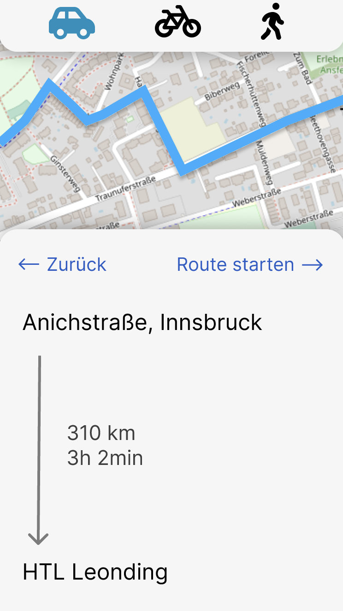

Das obige Bild zeigt die Mobile-Version.

#### 2.4.2 Workflow
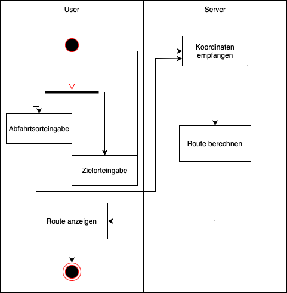

### 2.5 Aktive Navigation
Die aktive Navigation kann (nur auf Mobile-Geräten) nach der korrekten Eingabe des Start- und Zielortes gestartet werden. Der Button hierzu erscheint bei der Anzeige der Route.

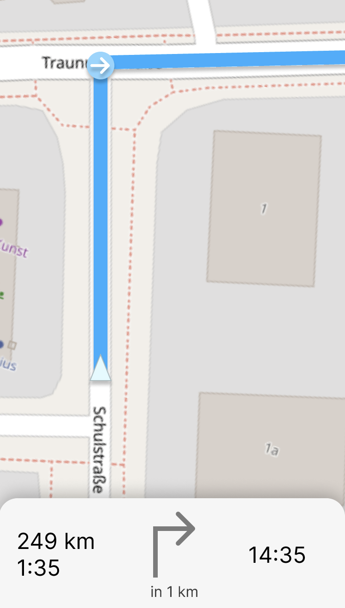

Ansicht wenn die Kreuzung noch entfernt ist.

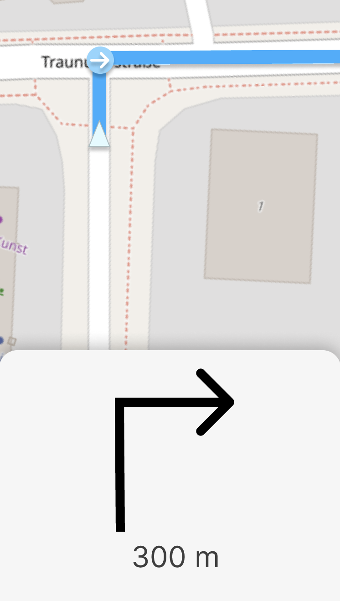

Anzeige kurz vor der Kreuzung.

## 3. Nicht-funktionale Anforderungen
### `Usability`: Benutzeranforderungen
* Die Software soll übersichtlich und einfach strukturiert sein

### `Efficiency`: Effizienzanforderungen
* Die Vorschläge der Adresseingabe darf nicht länger als 5 sek. dauern
* Die Routenberechnung darf nicht länger als 10 sek. dauern

### `Security`: Sicherheitsanforderungen 
* Bei Input-Feldern soll kein Code ausgeführt werden können
* Standortdaten dürfen nicht an Dritte weitergegeben werden

### `Legal`: Gesetzliche Anforderungen
* Die Datenschutzbestimmungen inklusive DSGVO, bezügl. der Speicherung von personenbezogenen Daten und deren sichere Verarbeitung. Die Daten dürfen nur mit begründetem Zweck gespeichert werden, bei uns liegt dieser nicht vor.
* Die Einhaltung des Urheberrechts, indem sichergestellt wird, dass die verwendeten Karten und andere geografische Daten rechtmäßig erworben wurden. OpenStreetMap und alle zugehörigen Kartendaten sind lizenziert mit der Open Data Commons *Open Database License* (ODbL) von der OpenStreetMap Foundation (OSMF). Diese sieht eine Kreditierung der OpenStreetMap und allen Mitwirkenden vor, wobei im Gegenzug alle Daten kopiert, verbreitet, übertragen und agepasst werden dürfen.
* Die Einhaltung der StVO, indem keine unerlaubten Routen generiert werden. Dabei muss auf viele Faktoren Rücksicht genommen werden, wie z.B. auf Richtungsfahrbahnen, Abbiegeverbote, Fahrverbote, Fußgängerzonen und Geschwindigkeitsbegrenzungen.
* Die Einhaltung der EU-Verordnungen über die Verwendung von GPS-Empfängern, die besagt, dass GPS-Empfänger so programmiert sein müssen, dass sie keine unerlaubten Funktionen bereitstellen.
  Unerlaubte Funktionen sind z.B.
    * Die Berechnung von Routen, die gegen geltende Gesetze oder Vorschriften verstoßen
    * Die Anzeige von Geschwindigkeitsbegrenzungen, die nicht den geltenden Gesetzen oder Vorschriften entsprechen
    * Die Anzeige von Informationen, die die Verkehrssicherheit beeinträchtigen könnten (z.B. Ablenkung durch unnötige Pop-ups)

## 4. Systemarchitektur
### Deployment-Diagramm
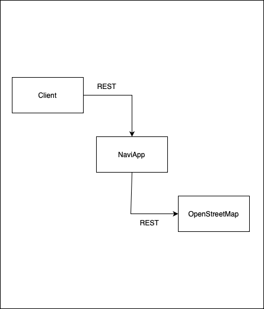

### Datenmodell
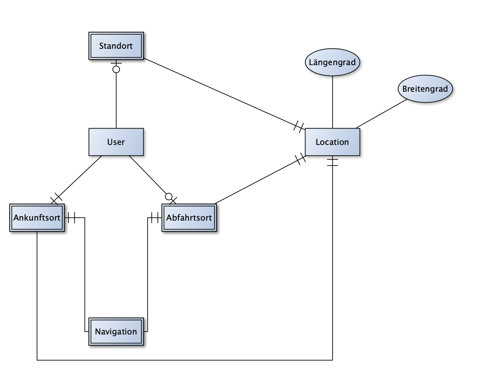